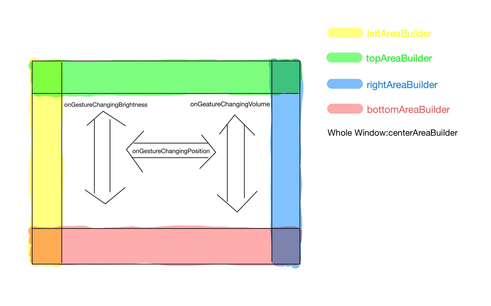

# refined_video_player

A better, highly customizable, user-friendly video player using PlatformView + SurfaceView on Android to fix https://github.com/flutter/flutter/issues/44793. IOS not implemented yet.

## Documentation

[中文文档](README_zh-CN.md)

## Why create this package?

If you don’t care about the picture quality of a video, you may never want to use refined_video_player. I believe some developers have just found that:

When playing videos, there exists sharp sawtooth that can be recognized just using our eyes. I tried about 6 kinds of video player packages using native TextureView (from external texture method), including video_player, fijkplayer, flutter_ijk_player, ijk_player, awsome_video_player(based on video_player) and chewie(based on video_player) to support video rendering and finally found that the problems are the same.

In order to offer the best experience of an application for its users, we need to solve this severe problem. Texture and PlatformView are the same in some degrees, but both of them have their own issues. Since I'm not an expert in Flutter developing, I chose a PlatformView way without considering other performance drawbacks. I just want to fix this annoying problem.÷

## How does it look like?

<video src="./doc/simple_player_demo.mp4" height="400" width="800"></video>

## Simply use it?

For simple use, just code like this:

```dart
class _VideoPageState extends State<VideoPage> {
  RVPController controller;

  @override
  void initState() {
    super.initState();
    controller = RVPController(
      "https://res.exexm.com/cw_145225549855002",
      onInited: () {
        controller.play();
      },
    );
  }

  @override
  void dispose() {
    controller.dispose();
    super.dispose();
  }

  @override
  Widget build(BuildContext context) {
    return Scaffold(
      appBar: AppBar(
        title: Text("VideoPage"),
      ),
      body: RefinedVideoPlayer(
        controller: controller,
      ),
    );
  }
}
```

For more detailed usage, please refer to the source code. You will see all detailed explanation of the parameters. Talk is too cheap. :P

## Advanced usage

Please refer to RefinedVideoPlayer params:



RefinedVideoPlayer has a default UI, which has been shown in previous video. If you just want to override any area, all you need to do is simply override its AreaBuilder. The following code shows how I managed to override topAreaBuilder and implemented an AppBar in RefinedVideoPlayer. In code:

1. I override topAreaBuilder and added an AppBar for Refined VideoPlayer.
2. I implemented my own hot reload logic in lifecycle didUpdateWidge, making this player possible to automatically reset its dataSource and seek to proper position when needed to (for example, setState).

The following demo shows how this customized player looks like:

<video src="./doc/diy_player_demo.mp4" height="400" width="800"></video>

Key code:

```dart
import 'package:flutter/material.dart';
import 'package:marquee_widget/marquee_widget.dart';
import 'package:online_mobile/solos/video.dart';
import 'package:refined_video_player/refined_video_player.dart';

class VideoPlayer extends StatefulWidget {
  final Record record;

  VideoPlayer({
    Key key,
    @required this.record,
  }) : super(key: key);

  @override
  _VideoPlayerState createState() => _VideoPlayerState();
}

class _VideoPlayerState extends State<VideoPlayer> {
  final videoAPI = VideoAPI.instance;
  RVPController controller;
  RefinedVideoPlayer playerInstance;
  bool showTopArea = true;

  @override
  void initState() {
    super.initState();
    controller = RVPController(
      widget.record.link.url,
      onInited: () {
        Future.wait([
          controller.seekTo(
            Duration(
              milliseconds: double.parse(widget.record.time).toInt(),
            ),
            true,
          ),
        ]);
      },
      onPaused: () => videoAPI.modifyRecord(
        widget.record,
      ),
      onTimeChanged: () => widget.record.time =
          controller.position.value.inMilliseconds.toString(),
    );
  }

  @override
  void didUpdateWidget(VideoPlayer oldWidget) {
    if (widget.record.link.url == controller.url) {
      super.didUpdateWidget(oldWidget);
    } else {
      Future.wait([
        controller.setMediaSource(widget.record.link.url),
        controller.seekTo(
          Duration(
            milliseconds: double.parse(widget.record.time).toInt(),
          ),
          true,
        ),
      ]).then(
        (value) => super.didUpdateWidget(oldWidget),
      );
    }
  }

  @override
  Widget build(BuildContext context) {
    playerInstance = RefinedVideoPlayer(
      controller: controller,
      topAreaBuilder: buildTopArea,
      onGestureTap: () => setState(
        () => showTopArea = !showTopArea,
      ),
    );
    return playerInstance;
  }

  Widget buildTopArea() {
    String videoName = widget.record.video.name.trim();
    String linkName = widget.record.link.name.trim();
    if (videoName != linkName) {
      videoName += "\t$linkName";
    }
    return Visibility(
      visible: showTopArea,
      child: Container(
        width: MediaQuery.of(context).size.width,
        height: 50,
        decoration: BoxDecoration(
          gradient: LinearGradient(
            begin: Alignment.topCenter,
            end: Alignment.bottomCenter,
            colors: [
              Colors.black,
              Colors.transparent,
            ],
          ),
        ),
        child: Row(
          crossAxisAlignment: CrossAxisAlignment.center,
          children: [
            IconButton(
              icon: Icon(
                Icons.arrow_back_ios,
                color: Colors.white,
              ),
              onPressed: () {
                if (controller.isFullScreen.value) {
                  controller.toggleFullScreen(playerInstance);
                  return;
                }
                Navigator.of(context).pop();
              },
            ),
            Marquee(
              child: Text(
                videoName,
                style: TextStyle(
                  color: Colors.white,
                  fontWeight: FontWeight.w500,
                  fontSize: 16,
                ),
              ),
            ),
          ],
        ),
      ),
    );
  }

  @override
  void dispose() {
    controller.dispose();
    videoAPI.modifyRecord(widget.record);
    super.dispose();
  }
}
```

## What’s more

1. This package is still under development, most of its functions are not well tested, and Most of its methods are not implemented. I’m still working on my way.
2. I haven't learnt Swift for iOS development, so it might be a long time before I manage to support iOS platform by myself.
3. Please help me and give me a PR if you have any improvement of this package, thank you very much! :)
